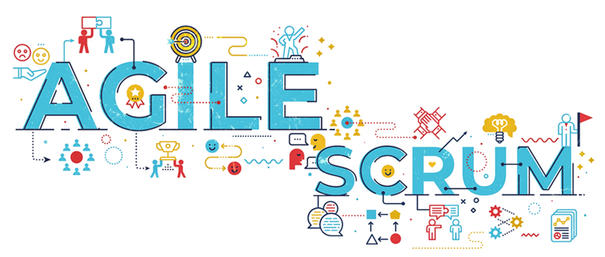
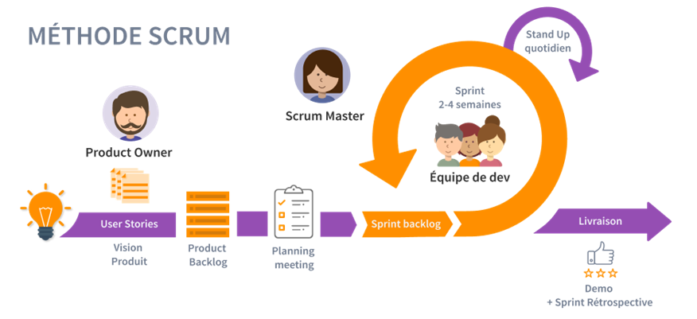
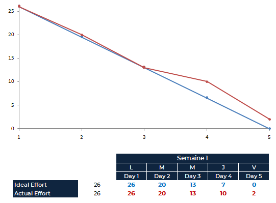

# ChatBot pour l’école IA Microsoft Brest Rapport Scrum
#### Céline, Pereg, Guillaume, Jérémy

 
## Contexte du projet
Un ChatBot (to chat + bot) est un robot conversationnel qui permet de répondre automatiquement, via une messagerie instantanée, aux requêtes/demandes d'un client (un être humain).

L'objectif phare du projet est de créer un ChatBot. Dans ce cas de figure, les clients vont être des nouveaux apprenants ou bien des partenaires potentiels de l'école qui posent des questions précises sur l’école Micorosoft IA Brest+. Le premier défi est que le ChatBot puisse répondre, automatiquement via des méthodes d'intelligence artificielle, à ces questions. Quant au deuxième défi, le ChatBot doit, à travers ses réponses, convaincre les visiteurs soit de postuler (les apprenants) ou de devenir un partenaire officiel. Par exemple, il doit intégrer des phrases qui font la force de l’école : Pédagogie active, Travail en équipe, Learning by teaching, évaluation par compétence, Type de partenariat, ....

## Modalités d'évaluation
Un rapport SCRUM qui reprend la présentation de l’équipe (scrum master, product ower…), les user stories priorisées, les backlogs sprint, les burndown charts, l’Impediment backlog, un lien vers le tableau de bord (Trello…), et tous les CR des cérémonials en annexe.

## Identification des participants
__Product Owner__ : Pereg H.

Le Product Owner (PO) est un chef de projet en mode agile. Il est en charge de satisfaire les besoins des clients en menant à bien la livraison d’un produit de qualité. Il sert d’interface entre l’équipe technique, l’équipe marketing et les clients. Au sein de son groupe de travail, il est le premier responsable de la conception du produit.

__Scrum Master__ : Jérémy LJ.

Avec l’équipe de développeurs et le Product Owner, il s’occupe de la gestion de produit. Membre de l’équipe, le Scrum Master n’a pas vocation à la diriger, mais à l’aider à être pluridisciplinaire et auto-organisée. Avec son soutien et son appui, l’équipe va constamment s’améliorer. Pour ce faire, le Scrum Master fait office de porte-parole entre son groupe de travail et le monde externe, la préservant ainsi des éléments incommodants qui pourraient réduire sa concentration et nuire à son fonctionnement.

__Equipe de Développeurs__ : Guillaume V., Céline G., Pereg H., Jérémy LJ.

## Product Backlog
Nous avons évoqué la plupart des User Stories dès le lancement du projet afin de bien caractériser les objectifs à remplir et prioriser les tâches. Après construction du tableau (Trello), le Product Backlog a été formé.

Ces US englobent plusieurs tâches qui seront traitées par l’équipe de développeurs. Certaines tâches sont axées sur la construction de l’IA, d’autres sur l’aspect Front/interface, des épics généraux à la demande du client. Le tableau est présent sur le fichier Excel Scrum.

User Stories | Type | Estimation | Priorité
:- |:-: |:-: |:-:
Je veux un ChatBot qui puisse répondre, automatiquement via des méthodes d'intelligence artificielle, à ces questions. | Intelligence Artificielle | 30 | 1 
Je veux des informations utiles sur la formation Simplon.| Général | 7 | 2 
Je veux une page web contenant le ChatBot. | Front/Interface | 2 | 3 
Je veux un ChatBot incorporé dans une fenêtre. | Front/Interface | 2 | 4 
Je veux pouvoir préciser si je suis futur apprenant ou partenaire. | Général | 1 | 5 
Je veux garder l'historique de la conversation. | Front/Interface | 1 | 6 
Je veux convaincre l'utilisateur en fonction de ses choix à postuler en tant que nouvel étudiant ou partenaire. | Général | 2 | 7 
Je veux pouvoir choisir ma langue. | Intelligence Artificielle/Front | 5 | 8 

## Sprint Planning 1
Pour ce premier sprint, nous avons retenu les US suivant : 

User Stories | Estimation | Progression
:- |:-: |:-:
Je veux un ChatBot qui puisse répondre, automatiquement via des méthodes d'intelligence artificielle, à ces questions. | 30 | En cours
Je veux des informations utiles sur la formation Simplon.| 7 | Terminé
Je veux une page web contenant le ChatBot. | 2 | Terminé
Je veux un ChatBot incorporé dans une fenêtre. | 2 | Terminé
Je veux pouvoir préciser si je suis futur apprenant ou partenaire. | 1 | Terminé

La première US a été réalisé avec une première solution *DialogFlow* (plus de détail dans le rapport Technique). Plus simple à mettre en oeuvre, l'estimation pour mettre en place cette technologie était d'un score de 5. Toutefois, la solution TF-JS est toujours en cours de développement. L'objectif de la dernière US a été atteint pour DialogFlow. Les 30 points d'estimations ont été réparties en "Sous-US". Ainsi, 15 points ont été réalisés.

Les US mettant en place la page Web et le ChatBot Messenger ont été réalisés rapidement pour les deux solutions de ChatBot (TF-JS et DialogFlow).

Les informations utiles sur la formation Simplon constituait notre base de données et a été construite et mis en place en fin de semaine. Davantage de données ont été rajoutées au fur et à mesure.

## Burndown Chart Sprint 1
Nous avons réparti les US afin de remplir l'objectif de la semaine.

## CR Sprint 1

__CR du Mardi__ 27/04/21 : 
* Le Scrum Master a réalisé le Trello et définit les US. L’équipe a estimé chaque US au poker planning.
* Documentation de toute l’équipe et réflexion sur la récolte des données (FaQ Simplon).
* Le PO a suggéré de tester DialogFlow en attendant de pouvoir poser les questions au client Mercredi.

__CR du Mercredi__ 28/04/21 : 
* Jérémy : Compte-Rendu et reconstruction du Trello pour qu’il correspond plus aux normes Agiles
* Guillaume et Pereg : Documentation sur DialogFlow et premiers tests en ligne.
* Céline a continué à fournir le Dataset en questions/réponse.

__CR du Jeudi__ 29/04/21 :
* Jérémy a développé la page Web et l’intégration de la fenêtre ChatBot.
* Céline et Guillaume ont réorganisé le Dataset (Questions/Réponses Apprenants/Partenaires) avec des réponses plus « humaines ».
* Pereg et Guillaume ont amélioré DialogFlow avec les données qui ont été nouvellement intégré au Dataset.
* __Réponses du Client__ : Il veut une IA sous Tensorflow-JS. DialogFlow étant pratiquement terminé, il sera développé et étoffé le lendemain avant qu’on passe sur l’IA exigé par le client.

__CR du Vendredi__ 30/04/21 : 
* Jérémy et Pereg ont intégré DialogFlow sur le Front et fonctionne.
* Documentation de l’équipe sur TF-JS.
* Guillaume et Céline ont remanié le Dataset pour les préparer au modèle IA.

__CR du Lundi__ 03/05/21 : 
* Pereg a construit les API qui seront utilisés pour faire le lien entre l’interface, le modèle IA et la Base de données.
* Céline et Guillaume ont effectué le Préprocessing des données et la construction du modèle IA.
* Jérémy a préparé l’intégration du ChatBot TF-JS, d’autres améliorations seront à faire.

