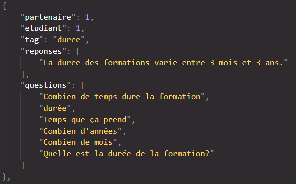
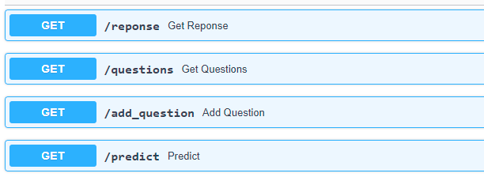

# ChatBot pour l’école IA Microsoft Brest Rapport Technique
#### Céline, Pereg, Guillaume, Jérémy

<br>

## Modalités d'évaluation
Un rapport technique sur le projet qui décrit les données, les choix techniques, le modèle utilisé, le code, l’architecture mise en place. Vous devez aussi proposer une solution de déploiement, son coût, et ses avantages. Enfin vous terminerez par une conclusion (performances, recommandations…).

## État de l’art sur les ChatBots
Les ChatBot sont des agents conversationnels qui dialoguent avec l’utilisateur et ayant pour but de donner l'illusion qu'un programme pense par un langage sensé. Influencés par la compétition sur le Test de Turing (test d’intelligence artificielle fondée sur la faculté d'une machine à imiter la conversation humaine), la recherche sur les ChatBots commence à prendre de l’ampleur vers la deuxième moitié des années 60. Le premier fut ELIZA qui simule un psychothérapeute rogérien en reformulant la plupart des affirmations du « patient » en questions, et en les lui posant.

Plus tard, ces programmes ont trouvé leur utilité sur Internet sous forme d’interface de messagerie (Messenger, Twitter, Facebook) ou d’outils de communication directement avec la voix comme Google Home ou Google Assistant sur smartphone.
Les ChatBots ne se limitent plus à des questions de base, mais intègrent désormais des algorithmes plus évolués permettant une gestion des échanges d'un niveau de complexité plus élevé qu'auparavant. 
On distingue notamment deux types de ChatBots : 
* Les bots simples, construits à partir d'éléments graphiques comme les boutons, les carrousels...
* Les bots intelligents, intégrant une technologie de compréhension du langage naturel (NLP).

L’engouement pour les ChatBots vient de sa démocratisation croissante au sein des entreprises qui, sans leurrer l’utilisateur, permettent de répondre rapidement aux interrogations et de l’orienter dans sa démarche informative. Les ChatBots permettent ainsi de diminuer les tâches répétitives pour laisser uniquement des tâches à réelle valeur ajoutée à réaliser.

## Choix pour la solution
### Choix de l’approche
Pour répondre à la problématique, à savoir la création d’un ChatBot traitant les questions les plus récurrentes sur la formation Simplon Data IA de l’école Microsoft, le choix s’est tourné vers l’utilisation de Tensorflow JS, par l’intermédiaire de modèles Tensorflow codés en Python et exécutés dans un navigateur. Cette solution était un point de modalité demandé pour ce projet.

Toutefois, nous avons aussi réalisé un ChatBot sous DialogFlow, une IA conversationnelle qui s’appuie sur les technologies de Deep Learning qui alimentent l’Assistant Google. C’est une solution simple et rapide d’intégration de ChatBot qui peut être intégré au Front sous forme de fenêtre Messenger. Sa conception est détaillée plus tard dans ce présent rapport.

### Choix du modèle
## La base de données
Avant de construire notre modèle, nous devons créer notre ensemble de données et pour celà, nous avons construit notre corpus à partir d'un fichier json.
Nous avons fais le choix d'une base MongoDB sur une VM en docker contenant une seule collection afin d'y stocker notre corpus. La base de données sera accessible à l'aide de l'API.

Chaque item de la base de données contient plusieurs variables:

- **tag**: La variable tag correspondent à des catégories uniques qui seront prédites par le modèle. Elle sert à faire le lien entre le modèle et les questions/réponses.

- **questions**: Ce sont les phrases qui vont servent à entrainer le modèle. Elles imitent des questions d'utilisateurs.

- **reponses**: Ce sont les réponses que le chatbot va répondre à l'utilisateur quand le tag de ces questions sera prédit.

- **etudiant**: Cette variable est un booléen qui sert à savoir si ce tag est pour les etudiants.

- **partenaire** Cette variable est un booléen qui sert à savoir si ce tag est pour les partenaires.



## API
Afin d'accéder à nos données, aussi bien pour l'entrainement du modèle que pour obtenir les réponses à envoyer à l'utilisateur, il nous faut un accès simple et rapide.

Nous avons donc fait le choix d'utiliser FastAPI afin d'obtenir une API REST accessible à distance avec l'IP de la VM.

Nous avons différents endpoints avec des usages différents:

- **/reponses**: Cet endpoint permet d'obtenir une réponse aléatoire (si la base en contient plusieurs) pour un tag ainsi que etudiant/partenaire donné.

- **/questions**: Permet d'obtenir l'ensemble des données d'apprentissage avec les phrases et les tags.

- **/add_question**: Cet endpoint permet d'ajouter une question à la base pour un tag donné.

- **/predict**: Permet, à partir d'une phrase en entrée de sortir une réponse prédite par le modèle et appelée depuis la base de données.



## Traitement de la question de l’utilisateur (les approches NLP utilisées)

Le preprocessing des données consiste à nettoyer notre corpus en effectuant plusieurs opérations:

* Supprimer les ponctuations.

* Gràce à la fonction Tokenizer on fragmente le corpus et on transforme les mots en vecteurs.

* La fonction ```pad_sequences``` est appliquée aux questions (variables explicatives) afin de les transformer en matrices.

On encode la variable category (target) afin qu'elle soit exploitée et confrontée aux questions pour le modèle.
    
La fonction ```pad_sequences``` transforme une liste (de longueur num_samples) de séquences (listes d'entiers) en un tableau 2D Numpy. 

Le tokenizer de Tensorflow attribue un jeton unique à chaque mot distinct. Le remplissage est effectué pour obtenir toutes les données à la même longueur afin de les envoyer à une couche RNN. les variables cibles sont également codées en valeurs décimales.

## Entraînement du modèle 
Après plusieurs essais de modèle en réseau de neurones convolutifs (CNN), notre choix de modèle s'est porté sur un modèle de réseau de neurones récurrent.

Le réseau se compose d'une couche d'intégration qui est l'une des choses les plus puissantes dans le domaine du traitement du langage naturel. 
les sorties de la couche d'enrobage sont l'entrée de la couche récurrente avec la porte lstm. Ensuite, la sortie est aplatie et une couche dense régulière est utilisée avec une fonction d'activation softmax.

La fonction LSTM permet non seulement de gérer efficacement la mémoire à court et long terme, mais également de conserver ou supprimer des informations gardées en mémoire.


## Création du site web et de la fenêtre du ChatBot
Afin de présenter les deux types de ChatBot confectionnés, une page Web unique a été réalisée en guise de « maquette ». Deux fichiers HTML ont été réalisés (*base.html* et *index.html*) avec un fichier *style.css* pour la mise en forme. Enfin, la fenêtre du ChatBot sous TF-JS a été développée sous JavaScript (*main.js*).


## Intégration du code du ChatBot dans le site web
Pour le ChatBot TF-JS, plusieurs fonctions ont d'abord été construites pour l'ouverture de la fenêtre et son animation. Un *chat-input* permet à l'utilisateur de rentrer son message et à l'envoyer avec la touche *Enter* ou en cliquant sur l'icone (*#chat-submit*). Une fois ce message envoyé, une fonction (*generate_message*) retourne le message du Bot 1s après. Le message de l'utilisateur est traité via la fonction *messageBot* qui retourne un message depuis la prédiction et la requête en base de données.


Pour le ChatBot DialogFlow, une intégration d’un script dans le fichier HTML généré depuis la plateforme a été réalisée.


## Évaluation du modèle

Nous obtenons pour notre modèle en RNN une accuracy de l'ordre de 94% sur nos données d'entraînement. Néanmoins, les résultats restent médiocres sur les données de test avec une accuracy en dessous de 50%. Le fait de jouer sur les hyperparamètres tels que le lr (learning rate) ou le nombre d'epochs, n'a engendré qu'une faible amélioration du modèle sur les données de test. 


## Problèmes non résolus et axes d’améliorations
Le choix d'un modèle RNN semble le bon choix malgrè des résultats de performance qui ne sont pas satisfaisants sur les données de validation. Ces résultats peuvent s'expliquer par le fait que le corpus ne soit pas suffisamment alimenté en questions. En effet, la réduction du nombre de "tags" a permis une amélioration des performances du modèle mais le nombre de questions par tags semble insuffisant. Une augmentation du nombre de questions permettrait certainement une augmentation de l'accuracy sur les données de validation et d'eviter un risque de surapprentissage du modèle.
