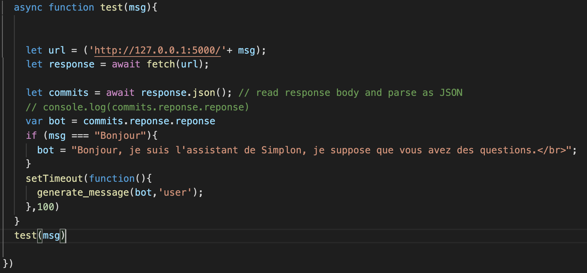

# ChatBot pour l’école IA Microsoft Brest Rapport Technique
#### Céline, Pereg, Guillaume, Jérémy

 

## Modalités d'évaluation
Un rapport technique sur le projet qui décrit les données, les choix techniques, le modèle utilisé, le code, l’architecture mise en place. Vous devez aussi proposer une solution de déploiement, son coût, et ses avantages. Enfin vous terminerez par une conclusion (performances, recommandations…).

## État de l’art sur les ChatBots
Les ChatBot sont des agents conversationnels qui dialoguent avec l’utilisateur et ayant pour but de donner l'illusion qu'un programme pense par un langage sensé. Influencés par la compétition sur le Test de Turing (test d’intelligence artificielle fondée sur la faculté d'une machine à imiter la conversation humaine), la recherche sur les ChatBots commence à prendre de l’ampleur vers la deuxième moitié des années 60. Le premier fut ELIZA qui simule un psychothérapeute rogérien en reformulant la plupart des affirmations du « patient » en questions, et en les lui posant.

Plus tard, ces programmes ont trouvé leur utilité sur Internet sous forme d’interface de messagerie (Messenger, Twitter, Facebook) ou d’outils de communication directement avec la voix comme Google Home ou Google Assistant sur smartphone.
Les ChatBots ne se limitent plus à des questions de base, mais intègrent désormais des algorithmes plus évolués permettant une gestion des échanges d'un niveau de complexité plus élevé qu'auparavant. 
On distingue notamment deux types de ChatBots : 
* Les bots simples, construits à partir d'éléments graphiques comme les boutons, les carrousels...
* Les bots intelligents, intégrant une technologie de compréhension du langage naturel (NLP).

L’engouement pour les ChatBots vient de sa démocratisation croissante au sein des entreprises qui, sans leurrer l’utilisateur, permettent de répondre rapidement aux interrogations et de l’orienter dans sa démarche informative. Les ChatBots permettent ainsi de diminuer les tâches répétitives pour laisser uniquement des tâches à réelle valeur ajoutée à réaliser.

## Choix pour la solution
### Choix de l’approche
Pour répondre à la problématique, à savoir la création d’un ChatBot traitant les questions les plus récurrentes sur la formation Simplon Data IA de l’école Microsoft, le choix s’est tourné vers l’utilisation de Tensorflow JS, par l’intermédiaire de modèles Tensorflow codés en Python et exécutés dans un navigateur. Cette solution était un point de modalité demandé pour ce projet.

Toutefois, nous avons aussi réalisé un ChatBot sous DialogFlow, une IA conversationnelle qui s’appuie sur les technologies de Deep Learning qui alimentent l’Assistant Google. C’est une solution simple et rapide d’intégration de ChatBot qui peut être intégré au Front sous forme de fenêtre Messenger. Sa conception est détaillée plus tard dans ce présent rapport.

### Choix du modèle
## La base de données
Avant de construire notre modèle, nous devons créer notre ensemble de données et pour celà, nous avons construit notre corpus à partir d'un fichier json, fonctionnant comme un dictionnaire python. Le corpus comprend deux variables:

**question**: ce sont les messages que l'utilisateur va envoyer au bot.

**category**: La variable category correspondent aux balises utilisées pour catégoriser les entrées et les mapper à un type particulier de réponse.

une fois que nous avons mappé une entrée sur une balise appropriée, nous pouvons sélectionner l'une des réponses à rendre à l'utilisateur.

## Traitement de la question de l’utilisateur (les approches NLP utilisées)

## Entraînement du modèle 
## Création du site web et de la fenêtre du ChatBot
Afin de présenter les deux types de ChatBot confectionnés, une page Web unique a été réalisée en guise de « maquette ». Deux fichiers HTML ont été réalisés (*base.html* et *index.html*) avec un fichier *style.css* pour la mise en forme. Enfin, la fenêtre du ChatBot sous TF-JS a été développée sous JavaScript (*main.js*).

## Intégration du code du ChatBot dans le site web
Pour le ChatBot TF-JS, plusieurs fonctions ont d'abord été construites pour l'ouverture de la fenêtre et son animation. Un *chat-input* permet à l'utilisateur de rentrer son message et à l'envoyer avec la touche *Enter* ou en cliquant sur l'icone (*#chat-submit*). Une fois ce message envoyé, une fonction (*generate_message*) retourne le message du Bot 1s après. Le message de l'utilisateur est traité via la fonction *messageBot* qui retourne un message depuis la prédiction et la requête en base de données.

Pour le ChatBot DialogFlow, une intégration d’un script dans le fichier HTML généré depuis la plateforme a été réalisée.

## Évaluation du modèle
## Problèmes non résolus et axes d’améliorations

